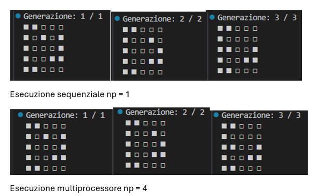
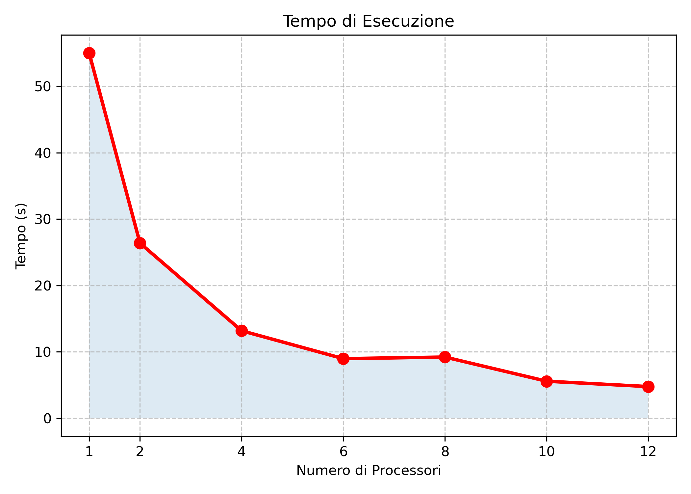
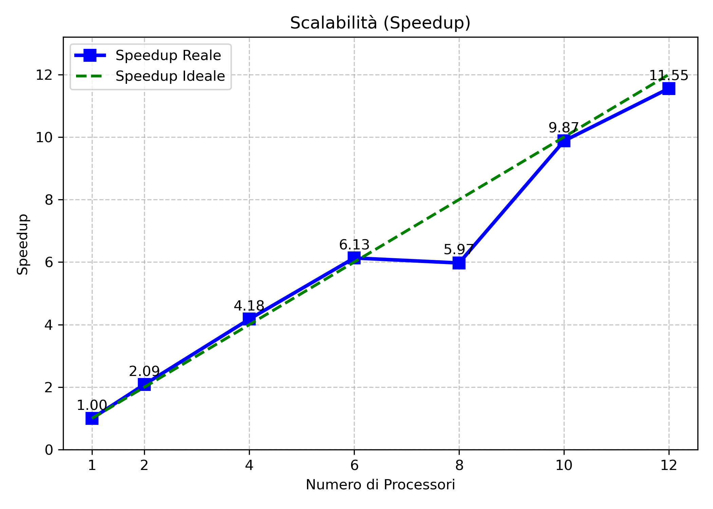
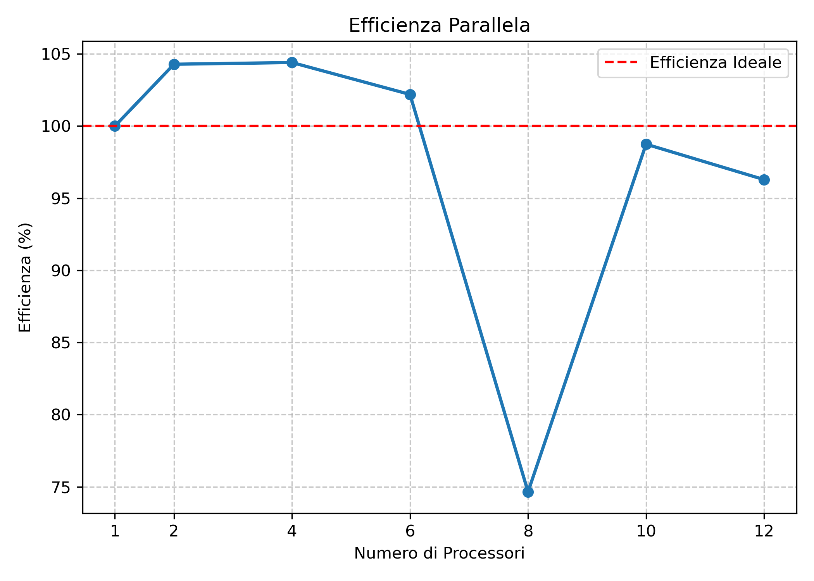

# MPI Game of Life on Google Cloud

This repository contains a parallel C implementation of Conway’s Game of Life using MPI. The project is designed to run on Google Cloud Compute Engine through remote access with `gcloud`, deploying the source code on small VM instances and executing the simulation with different numbers of processes.

To ensure reproducibility and a clean deployment workflow, the repository focuses on a practical end-to-end setup: creating the VMs, connecting remotely, installing MPI, uploading the source code, compiling it, and launching the program.

The implementation is based on a one-dimensional domain decomposition strategy: the master process initializes the full matrix, splits the rows across the available MPI processes, and gathers the final result after the simulation ends.

## Table of Contents

- [Conway's Game of Life](#conways-game-of-life)
- [Solution Requirements](#solution-requirements)
- [MPI Parallelization Strategy](#mpi-parallelization-strategy)
- [Google Cloud Setup](#google-cloud-setup)
- [Compilation](#compilation)
- [Execution](#execution)
- [Validation](#validation)
- [Troubleshooting](#troubleshooting)

## Conway's Game of Life

Conway's Game of Life is a cellular automaton devised by John Horton Conway in 1970. It is a zero-player game whose evolution depends entirely on the initial configuration.

The game is played on a two-dimensional grid of square cells. Each cell can be either alive or dead, and at each generation it updates according to the number of live neighbors in its Moore neighborhood:

- Underpopulation: any live cell with fewer than two live neighbors dies.
- Survival: any live cell with two or three live neighbors survives.
- Overpopulation: any live cell with more than three live neighbors dies.
- Reproduction: any dead cell with exactly three live neighbors becomes alive.

This project uses those rules to benchmark a distributed MPI implementation on multiple processes.

## Solution Requirements

### Core Architecture

The project is implemented in native C and uses the standard MPI library for parallel execution in a distributed-memory environment.

### Dynamic Matrix Size

The program supports arbitrary matrix dimensions. In the current implementation, the matrix size is defined directly in the source code through the `N` and `M` variables.

### Execution Depth

The number of generations is also defined in the source code through the `iterazioni` variable. Setting it to `0` keeps the initial state unchanged.

### Master-Worker Model

Process `0` acts as the master. It allocates and initializes the full matrix, distributes row chunks to the workers, and collects the final result at the end of the execution.

### Deterministic Output

For the same initial matrix and the same number of iterations, the simulation produces deterministic results regardless of the number of MPI processes used, provided the decomposition is valid.

## MPI Parallelization Strategy

The code uses a simple row-based partitioning model. The global matrix is split among processes by rows, and each process receives a contiguous chunk of the grid.

Each worker allocates a local buffer with two extra ghost rows: one for the top neighbor and one for the bottom neighbor. During each generation, the process exchanges border rows with adjacent ranks using non-blocking MPI communication.

The computation flow is:

1. The master builds the initial matrix and sends row chunks to the workers.
2. Each worker exchanges top and bottom boundary rows.
3. Inner cells are updated first, while communication is in progress.
4. Border rows are updated after halo exchange completes.
5. The local buffers are swapped for the next generation.
6. The master gathers all chunks and prints the final matrix.

The implementation also handles edge processes correctly by using `MPI_PROC_NULL` for missing neighbors.

### Implementation Notes

The helper function `allocamatrix` allocates a contiguous 2D matrix representation in memory. The function `isalive` checks whether a cell is alive while applying horizontal wrap-around on column indices.

The update logic is split into two parts:

- Inner cells are computed first for the rows that do not depend on missing halo data.
- Border cells are computed after the exchange of the ghost rows.

This makes the code easy to follow and keeps the communication pattern explicit.

## Google Cloud Setup

Before starting, install these tools on your local machine:

- Google Cloud SDK (`gcloud`)
- An active Google Cloud account and project
- SSH support on your machine
- `git` recommended

Google Cloud requires selecting or creating a project, enabling billing, and enabling the Compute Engine API before creating VM instances.

### 1. Configure Google Cloud locally

Log in and initialize `gcloud`:

```bash
gcloud init
```

Then set your default project and zone:

```bash
gcloud config set project YOUR_PROJECT_ID
gcloud config set compute/zone europe-west8-b
```

You can replace the zone with any available zone you prefer.

### 2. Create the VM instances

For this project, use `e2-micro` instances as requested.

Example using the CLI:

```bash
gcloud compute instances create gol-vm-1 --zone=europe-west8-b --machine-type=e2-micro --image-family=debian-12 --image-project=debian-cloud
gcloud compute instances create gol-vm-2 --zone=europe-west8-b --machine-type=e2-micro --image-family=debian-12 --image-project=debian-cloud
gcloud compute instances create gol-vm-3 --zone=europe-west8-b --machine-type=e2-micro --image-family=debian-12 --image-project=debian-cloud
gcloud compute instances create gol-vm-4 --zone=europe-west8-b --machine-type=e2-micro --image-family=debian-12 --image-project=debian-cloud
```

### 3. Connect remotely with gcloud

Connect to the main node:

```bash
gcloud compute ssh gol-vm-1 --zone=europe-west8-b
```

Do the same for the other VMs when needed. If your environment uses OS Login, you can explicitly add a public key with:

```bash
gcloud compute os-login ssh-keys add --key-file ~/.ssh/id_rsa.pub
```

### 4. Prepare each VM

Once connected to each machine, update the system and install the required packages.

For Debian or Ubuntu:

```bash
sudo apt update
sudo apt install -y build-essential openmpi-bin libopenmpi-dev git
```

Verify the installation:

```bash
mpicc --version
mpirun --version
```

### 5. Upload the code

There are two practical ways to move the project to Google Cloud.

If the project is already on GitHub:

```bash
git clone https://github.com/YOUR_USERNAME/YOUR_REPOSITORY.git
cd YOUR_REPOSITORY
```

Or copy the project from your local machine with `gcloud scp`:

```bash
gcloud compute scp --recurse ./YOUR_PROJECT_FOLDER gol-vm-1 --zone=europe-west8-b
```

### 6. Create the cluster host file

To run MPI across multiple VMs, create a `hosts` file on the main node:

```txt
gol-vm-1 slots=1
gol-vm-2 slots=1
gol-vm-3 slots=1
gol-vm-4 slots=1
```

If name resolution is not available, you can use the internal IP addresses instead.

### 7. Enable passwordless SSH between nodes

On `gol-vm-1`, generate an SSH key pair:

```bash
ssh-keygen -t rsa -b 4096
```

Accept the default path and leave the passphrase empty.

Then copy the public key to the other nodes:

```bash
ssh-copy-id USER@gol-vm-2
ssh-copy-id USER@gol-vm-3
ssh-copy-id USER@gol-vm-4
```

Test connectivity:

```bash
ssh gol-vm-2 hostname
ssh gol-vm-3 hostname
ssh gol-vm-4 hostname
```

## Compilation

Inside the project folder, compile the MPI program with:

```bash
mpicc -O2 -o gameoflife gamelife.c
```

If you prefer a Makefile, compilation can also be managed with:

```bash
make
```

## Execution

To run locally on a single VM:

```bash
mpirun -np 1 ./gameoflife
```

To run with multiple local processes on the same machine:

```bash
mpirun -np 2 ./gameoflife
```

To run across multiple VMs:

```bash
mpirun -np 4 --hostfile hosts ./gameoflife
```

The matrix dimensions and the number of generations are currently controlled in the source code, so changing them requires editing `N`, `M`, and `iterazioni` and recompiling.


## Troubleshooting

Possible causes of MPI startup issues:

- SSH keys are not configured correctly.
- The hostname or internal IP in the `hosts` file is wrong.
- OpenMPI is installed on some nodes but not on all of them.

If `mpirun` cannot connect to worker nodes, make sure the same executable is present on every machine.

Because `e2-micro` instances are very small, large matrices may cause slowdowns or memory pressure. Start with small and medium sizes before scaling up.

## Cleanup

When experiments are finished, delete the instances to avoid unnecessary charges:

```bash
gcloud compute instances delete gol-vm-1 gol-vm-2 gol-vm-3 gol-vm-4 --zone=europe-west8-b
```


## Validation

The implementation can be validated by checking classic Game of Life patterns:

- A block should remain unchanged.
- A blinker should alternate between horizontal and vertical states.
- A glider should move diagonally over time.

A good sanity check is to compare the output of a single-process run against a multi-process run started from the same initial matrix. Since the algorithm is deterministic, the final grid should match.

### Console Demo

The following animation shows the evolution of Conway's Game of Life directly in the terminal during execution.

![Console Demo] (images/gamelife.gif)

### Deterministic Execution Verification

To verify the correctness of the parallel implementation, the simulation was executed multiple times using the same initial seed and the same number of generations while varying the number of MPI processes.

The final matrices obtained with different process counts were identical, confirming that:

- The domain decomposition strategy is correct.
- Ghost-row exchanges preserve neighborhood information across process boundaries.
- The implementation is deterministic.
- Cell transitions between alive (`L`) and dead (`D`) states follow Conway's rules correctly.



*Figure 1. Console output showing identical results obtained with different MPI process counts.*

### Validation of row decomposition and ghost-row exchange

Since the matrix is partitioned by rows, the correctness of the parallel decomposition was verified by testing patterns that interact with process boundaries. Configurations placed across the split between two ranks evolved consistently, showing that the exchange of top and bottom ghost rows works correctly. This confirms that the non-blocking communication used in the worker routine preserves the neighborhood information needed to update border cells.

### Deterministic parallel execution

For the same initial matrix and the same number of iterations, runs executed with different MPI process counts produced the same final configuration. This confirms that the implementation is deterministic and that the master-worker decomposition, halo exchange logic, and final gather phase do not alter the semantics of the simulation.

## Validation Report

The correctness of this MPI implementation of Conway's Game of Life was validated through deterministic pattern tests, boundary-condition checks, and comparisons between single-process and multi-process executions.


### Performance analysis (scalability study)

To evaluate the scalability of the implementation, a performance analysis was conducted using a fixed matrix size of 2000×2000. The number of MPI processes was varied from 1 to 12 (1, 2, 4, 6, 8, 10, and 12 processes).



The first figure shows the execution time. As expected, execution time decreases as the number of processes increases.



The second figure shows the speedup. The speedup curve at first shows a linear trend, but then it starts becoming sub-linear due to communication overhead and synchronization costs.



The third figure shows the parallel efficiency of the implementation. Efficiency decreases as the number of processes increases, which is expected in a distributed-memory model where communication becomes dominant for larger process counts.


Overall, the results confirm that the implementation scales well up to a moderate number of processes, while showing diminishing returns at higher process counts due to communication overhead.

